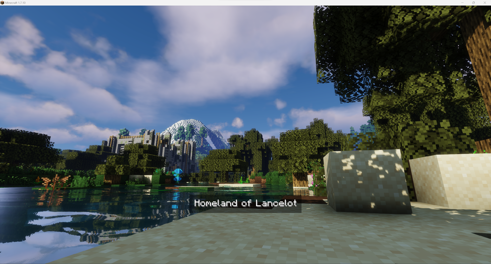

# Interworlds Splashscreens
[](https://www.curseforge.com/minecraft/mc-mods/interworlds-splashscreens)
[](https://www.curseforge.com/minecraft/mc-mods/interworlds-splashscreens)
[](https://discord.gg/weChv5cF)
[](https://dreamfinity.org)

Clientside-mod that allows you to add custom loading screens while you are transferred into another dimension

You can also add some text on the screen to display it to players

It also has a fallback if you didn't add splashscreen for some worlds

Some examples:
Overworld:


Nether:


The End:


Configuration:
```access transformers
"splashes files" {
    # Default splash to be used if not set for world [default: Overworld]
    S:defaultSplash=Overworld_water

    # Splashes images to be used in loading screen. Use just filename without extension. Files must be stored in folder splashes in mod's config directory [default: [Nether:Nether], [The End:The End], [Overworld:Overworld], [splashConnecting:Overworld], [splashDisconnecting:Overworld]]
    S:splashesPaths <
        Nether:Nether
        The End:The End
        Overworld:Overworld_water
        splashConnecting:Overworld
        splashDisconnecting:Overworld
     >
}

"splashes texts" {
    # Splashes texts to be displayed on splash [default: [Nether:Nether], [The End:The End], [Overworld:Overworld], [splashConnecting:Overworld], [splashDisconnecting:Overworld]]
    S:splashesTexts <
        Nether:A hot Hell filled with dangerous creatures
        The End:Far, far strange world filled with Endermans and the Dragon
        Overworld:Homeland of Lancelot
        splashConnecting:Overworld
        splashDisconnecting:Overworld
     >
}
```

